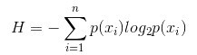

# 决策树 Decision Tree

## 理论
### 基本理论
用水平、垂直线对平面不停分割，直到区域内只有一类
选择分割线：最小化分割后的基尼不纯度（纯度高则分割后只有一类数据），或优化信息熵
	信息熵公式：
    
  条件熵公式：  
  
  n代表有n个分类类别（比如假设是2类问题，那么n=2）。分别计算这2类样本在总样本中出现的概率p1和p2，这样就可以计算出未选中属性分枝前的信息熵。  
修剪枝节：在数据量很大时，可以不用完全分完。

### ID3, C4.5
ID3算法：若一特征划分后数据不确定性减少的最多，就对该特征进行分裂。以信息论为基础，以信息熵和信息增益度为衡量标准，从而实现对数据的归纳分类。ID3算法计算每个属性的信息增益，并选取具有最高增益的属性作为给定的测试属性。

C4.5算法核心思想是ID3算法，是ID3算法的改进，对特征的取值多少进行归一化：
1）用信息增益率来选择属性，克服了用信息增益选择属性时偏向选择取值多的属性的不足；
2）在树构造过程中进行剪枝
3）能处理非离散的数据
4）能处理不完整的数据

C4.5算法优点：产生的分类规则易于理解，准确率较高。
缺点：
1)没有剪枝步骤，易于过拟合; C4.5只能用于分类；生成多叉决策树，没有二叉树高效
2)在构造树的过程中，需要对数据集进行多次的顺序扫描和排序，因而导致算法的低效。
3)C4.5只适合于能够驻留于内存的数据集，当训练集大得无法在内存容纳时程序无法运行。

### CART
生成二叉树，每个节点都只能分裂成两个节点
采用基尼系数衡量数据不确定性，去掉对数运算。如果目标变量是标称的，称为分类树；如果目标变量是连续的，称为回归树。
对给定样本D，假设有K类，第K类的数量为CK，则基尼系数为：
 
基尼系数越小，不确定性越小，特征越好，含义与熵相反
优点：
非常灵活，可以允许有部分错分成本，还可指定先验概率分布，可使用自动的成本复杂性剪枝来得到归纳性更强的树。
在面对诸如存在缺失值、变量数多等问题时CART 显得非常稳健。

### 优缺点
a. 优点
决策树易于理解和解释，可以可视化分析，容易提取出规则。
可以同时处理标称型和数值型数据。既可以处理离散值也可以处理连续值。很多算法只是专注于离散值或者连续值。
测试数据集时，运行速度比较快。
决策树可以很好的扩展到大型数据库中，同时它的大小独立于数据库大小。
b. 缺点
对缺失数据处理比较困难。
决策树算法非常容易过拟合，导致泛化能力不强。可以通过设置节点最少样本数量和限制决策树深度来改进。随机森林可以很大程度上减少过拟合
忽略了数据之间的相关性；
ID3算法计算信息增益时结果偏向数值比较多的特征。如果某些特征的样本比例过大，生成决策树容易偏向于这些特征。这个可以通过调节样本权重来改善。

## Python实现
### sklearn
决策树没有用到欧式距离，因此数据预处理不需要进行特征缩放。且不进行特征缩放时，在解释决策树分类时，可以直接看到数据的实际含义；但在画图时x1, x2的step比较时会用到特征缩放
	from sklearn.tree import DecisionTreeClassifier
	classifier = DecisionTreeClassifier(max_depth,criterion = “entropy”, random_state = 0) #建立分类器 criterion可以为gini或entropy熵，max_depth树最大深度
	classifier.fit(X_train, y_train) #训练集拟合分类器
	y_pred = classifier.predict(X_train) #预测
### 自实现
